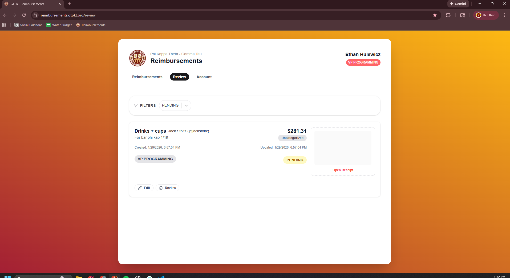

MVP REQUIREMENTS

ROUTES
__________________________________________________________________________________________________________

- URL format helper (avoid inline f-strings; centralize paths in frontend)
  - File: `frontend/src/api/paths.ts`
  - Example:
    - /events/:eventId/duties/:eventDutyId/assignments
  - Usage:
    - paths.events.dutyAssignments(eventId, eventDutyId)

- API CONTRACT (PRIMARY)
    - All list endpoints accept pagination:
        - page (1-based)
        - page_size (max 100)
        - response returns { success, data..., meta: { page, page_size, total, total_pages } }

    - /brothers
        - GET /brothers
            - query: role_ids (repeat), order_by=points|name, order=asc|desc, page, page_size
            - returns points (calculated), last_semester_points, role_id, phone_number
        - POST /brothers/:brother_id/points
            - body: { event_id, amount, reason }
            - creates a point_adjustment entry tied to the event

    - /events
        - GET /events
            - query: from, to, include_duties (true|false), page, page_size
        - POST /events
            - body: { name, event_definition_id, date, start_time, end_time }
        - GET /events/:event_id

    - /duties (PRIMARY, flat filter endpoints)
        - GET /duties?event_id=...
        - POST /duties (create event duty)

    - /assignments (PRIMARY, flat filter endpoints)
        - GET /assignments?event_id=...&event_duty_id=...&brother_id=...
        - POST /assignments (sign up)
        - PUT /assignments/:assignment_id (status update)
        - DELETE /assignments/:assignment_id (drop)

    - /eventDefinitions
        - GET /eventDefinitions
        - POST /eventDefinitions
        - GET /eventDefinitions/:event_definition_id/duties

    - /dutyDefinitions
        - GET /dutyDefinitions
        - POST /dutyDefinitions

    - /auth (late stage)
        - POST /auth/login
        - POST /auth/logout
        - POST /auth/reset
        - PUT /auth

- API CONTRACT (SECONDARY / COMPAT)
    - /events/:event_id/duties
    - /events/:event_id/duties/:event_duty_id/assignments

- /auth
    - POST /auth/login
        - create session
        - send cookie to server/browser based on session details
    - POST /auth/logout
        - reads cookie to find and delete session
        - delete cookie

    Password will remain unused for now and user will just "login" with slac id
    - POST /auth/reset
    - PUT /auth
        - updates password

- /brothers
    - calculatePoints =
        0.75 * last_semester_points
        + SUM(completed event_duty points for brother)
        + SUM(point_adjustment.amount for brother)

    - All manual/admin points are ledger entries tied to an event (point_adjustment.event_id NOT NULL).

    - GET { points: calculatePoints } rather than getting both fields. The total points is all that will ever be used
    - GET /brothers
        - ability to order by by points( calculated ) or name asc/desc
        - ability to filter by 1+ roles ( only return values of those roles )
        - pagination (page/page_size)
        - base request return should be natrually sorted highest->lowest points ( alphabetical for instances of same points )
    - PUT /brothers/brother
        - updating points will create a point_adjustment entry tied to a chosen event
        - will only be used on page 3.

- /events
    - /events/:event_id/duties
    - /events/:event_id/duties/:event_duty_id/assignments

- /eventDefinitions
    - /eventDefinitions/:id/duties

- /duties
- /dutyDefitions

OPEN QUESTION
__________________________________________________________________________________________________________
- Route shape locked: primary flat filter endpoints (/duties, /assignments), keep nested
  routes as secondary for compatibility/docs.

PAGES AND LOGIC
__________________________________________________________________________________________________________

0. Login page
    - Accounts will be based on the brother table (initially NULL)
    - Accounts will be tied to slack IDs
    - Implement accounts and admin priveleges
    - Frogot passwords option

1. Duty event sign up page
    BEFORE EVENT
    - Select event by dropdown -> dispaly all event duties
        - Duty should show due time (or start time for during events)
        - Slots filled / Slots total
        - Names of people who have filled the slots
        - Mark as complete button
            - Will show up for purchase/setup/cleanup duties. Once selected it is locked
            - Will only show up to admins for during duties. No automatic reject
        - Reject button
            - Will only show up for admins
            - When clicked by admin
                - Complete button will dissapear for non-admins and they will only see the selected rejected
                - Adminms will still the see the complete button and have the ability to click that (which will also flip off rejected and allow users to see completed again)

    - Duty Status for purchase/setup/cleanup
        - Display 'assigned' before due time
        - Display 'late' between 5 minutes - 1 hour after setup
        - At one hour display 'rejected'
        - If completed display 'completed' then
    - Duty Status for during
        - Display 'assigned' until otherwise set by admins
        - Upon marking as completed/rejected dispaly that

    - 5pm on Sunday the week BEFORE the event:
        - duties will be unlocked and evailable for signup
        - send an @channel in slack ACTIVES_ANNOUNCMENTS including all the people who were fined for not completing a duty in the last week (public shaming)
        - send a dm to chris goggins to notify the people he needs to fine and the ammounts
    - At 7:30pm on Wednesday STILL THE WEEK BEFORE THE EVENT, duty signup will be locked open duties will be assigned 

    - Duties will be assigned in this order:
        - DUTIES WILL NOT BE ASSIGNED TO BROTHERS WITH THE SOCIAL TEAM ROLL
        - Social_team/admin will receive the given admin points for each event after event date passes

        - Duties with highest points will be assigned first to brothers with the lowest amount of points
        - If 2+ duties are the same point value they be assigned in alphabetical order
        - If 2+ brothers have the same amount of points they will be randomly selected for the current duty that is being assigned

    AFTER / DURING EVENT
    - Setup/Purchase/Cleanup duties that are not marked completed within 5 minutes of event_duty.time will be marked as LATE
    - Setup/Purchase/Cleanup duties that are not marked completed within 1 hour of event_duty.time will be marked as REJECTED

    - During duties will be marked as completed / rejected by social social chairs and other logic should not apply. The time will only be used for the brother to tell the slot time
    - There is no completion deadline for during duties and will never be marked later. They will only be marked completed/reject.

    - Admins powers:
        - Deny duties that were marked as completed
        - Mark duties that were denied as completed

2. Home Page
    - Calendar showing all events. Clicking an event on the calendar will bring you to page #1 with that event selected.
    - Display for all duties you are currently signed up for

3. Brother List
    - Dispaly name, points (current total calculated), role, phone number
    - Ability to sort the following columns ascending/descending
        - name
        - points
    - Abilty to filter by (only display) 1+ roles
    - DEFAULT: sortend descending points, alphabetically second. Inactive members should natrually be hidden, but can be viewed by selecting it in the filter.
    - Admin
        - Add/Remove points from brothers on the Brother List page

4. Admin only page to create new duty/event definitions as well as new event instances for the calendar
    - Add new event to calendar
        - Select event type
        - Add additional duties
        - Edit points/available spots for different duties
    - Add new duty definition
        - duty_type
        - description
    - Add new event type defintion
        - duties
        - edit default points/spots

 for an example of what the ui should look similar too (other frat website and want to stay similar)

water bottle for open parties
